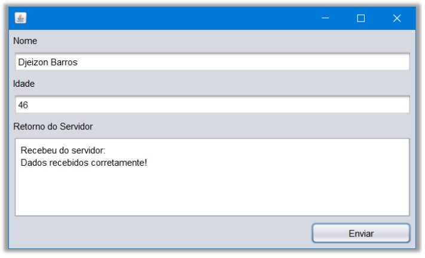

# Redes..

## Este material foi desenvolvido em resposta a disciplina 'Redes', a qual faz parte do curso de Pós Graduação em Tecnologia Java, ministrado pela Universidade Tecnológica Federal do Paraná.
🎉 Os projetos, são exercícios solicitados ao longo do curso que juntos perfazem a nota que compõem a média final.

🥋 Se você está entrando no Java agora, vou deixar um comentário apenas para orientá-lo, caso considere o código deste exercício estranho. Este exercício, foi considerado pelo professor e os demais colegas como MEDIANO. (_😎tirei nota máxima_), contudo, o assunto aqui é REDES. Isso, por si só, não é nada convencional para desenvolvedores acostumados com devWeb. Caso se identifique, considere que REDES é uma potencialidade do Java explorada por poucos, más que pode perfeitamente unir forças com o desenvolvimento web. É perfeitamente possível que uma aplicação Java-Swing possua funcionalidades associadas as bibliotecas de REDE (lan - local area network) para aumentar sua eficiência.

## Servidor de Redes

😵 Objetivo:

Neste ponto do curso vamos abordar o conceito de uma aplicação Cliente-Servidor e explicar como ele está relacionado à programação de redes. Na verdade, trata-se do exercício da branch servidor-redes, contudo, esta versão foi alterada para receber conexões de múltiplas aplicações que estejam conectadas a ela. 
O foco na branch servidor-redes é que a aplicação recebe apenas uma conexão por vez e para que receba outra, a primeira deve ser fechada. Nesta branch, o número de conexões está sujeito a quantidade de memória.

🧭 Sobre a aplicação...
 Uma aplicação Swing Cliente-Servidor envolve a criação de uma interface gráfica de usuário (GUI) usando a biblioteca Swing no lado do cliente e a implementação de um servidor que recebe e processa solicitações do cliente. Vamos dividir isso em duas partes, Cliente e Servidor.

### Cliente Swing:
- Interface Gráfica de Usuário (GUI): Use a biblioteca Swing para criar uma interface gráfica interativa. Componentes Swing incluem botões, campos de texto, áreas de texto, etc.
- Conexão com o Servidor: Use classes como Socket para estabelecer uma conexão com o servidor. Envie e receba dados entre o cliente e o servidor.

### Servidor:
- Servidor para Receber Conexões: Crie um servidor que aguarde a conexão de clientes.
- Use um loop para aceitar várias conexões.

## Enunciado da atividade
👉 Desenvolva uma aplicação em que vários clientes, utilizando componentes gráficos da 
biblioteca Swing, transmitam o objetom Pessoa (atributos: nome e idade) para o 
servidor. O servidor deve exibir em seu console de execução, os dados recebidos do 
cliente. O cliente deve receber um aviso do servidor, informando que os dados foram 
transmitidos corretamente, mostrando isso em uma TextArea.

🎯 O Servidor deve ser capaz de lidar com vários Clientes de forma concomitante...

Use conexão do localhost, ou seja, o IP 127.0.0.1, para a conexão cliente-servidor. Não use o endereçamento de sua LAN (ex. 192.168.10.10). A porta fica a 
critério do aluno, desde que não seja pertencente às portas baixas ou portas 
reservadas.

Utilize a figura abaixo como modelo para o cliente:


# Tecnologia utilizada:


## Tabela de Conteúdos

- [Instalação](#Instalação)
- [Uso](#Uso)
- [Contribuição](#Contribuição)

## Instalação

1. Clone o repositório ou baixe o arquivo .zip:

```bash
git clone https://github.com/alfecjo/redes.git
```
## Uso

1. Execute em sua IDE de preferência. Contudo, o desenvolvimento foi feito no NetBeans, ideal JDK 11 ao 13! Você pode começar com: "mvn install", no diretório raiz, que é onde se    encontra o arquivo pom.xml. Desta forma, serão baixadas as dependências, caso seja necessário.
2. A idéia central aqui é que usando a biblioteca Swing, com a criação de dois projetos simples, o primeiro, Cliente composto por ClienteForm.form, ClienteForm.java e Pessoa.java, em uma máquina, o segundo, Servidor.java em outra e através do wifi ou rede cabeada, possa passar objetos.
3. Caso tenha o Java instalado, você precisa apenas executar os arquivos .class em máquinas distintas.
5. Quanto ao código relativo a construção de Forms e demais elementos gráficos, é possível encontrar informações mais detalhadas na internet. Haja visto que o foco aqui é a passagem de objetos pela rede e o uso de Socket.

## Contribuição

Contribuições são bem-vindas! Se você encontrar algum problema ou tiver sugestões de melhorias, abra um problema ou envie uma solicitação pull ao repositório.

Ao contribuir para este projeto, siga o estilo de código existente, [convenções de commit](https://www.conventionalcommits.org/en/v1.0.0/), e envie suas alterações em um branch separado.

Muito obrigado!!
